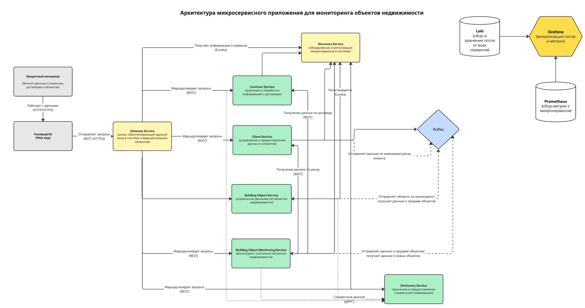
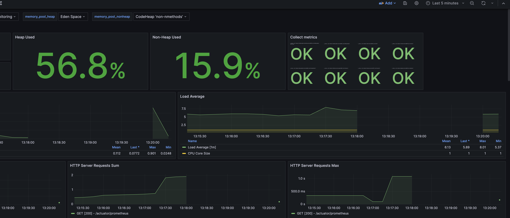
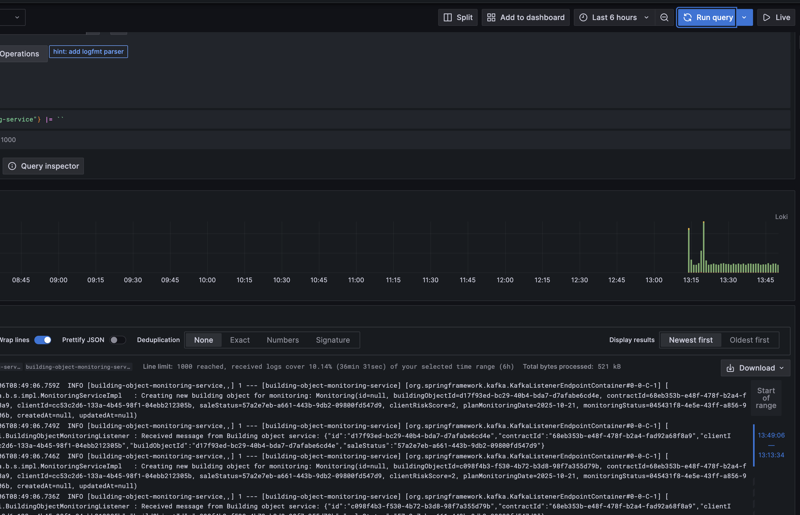

# 🧩 Проектная работа Java Advanced 2025

## 🏗️ Описание проекта

**Микросервисное приложение для мониторинга объектов недвижимости.**  
Проект реализует распределённую систему на базе Spring Boot, использующую современные подходы микросервисной архитектуры, взаимодействие через gRPC и REST, а также систему мониторинга и логирования.

### Основные сервисы

| Сервис | Описание |
|--------|-----------|
| **discovery** | Сервис для обнаружения и регистрации микросервисов в системе (Eureka Server). |
| **gateway** | API-шлюз, обеспечивающий единый вход в систему и маршрутизацию запросов. |
| **dictionary** | Сервис для хранения и предоставления справочной информации. |
| **client** | Сервис для управления данными о клиентах. |
| **contract** | Сервис для хранения и обработки информации о договорах. |
| **building-object** | Сервис для управления данными об объектах недвижимости. |
| **building-object-monitoring** | Сервис для мониторинга состояния объектов недвижимости. |
| **data-generator** | Сервис для генерации тестовых данных и нагрузочного тестирования. |

---

## 🧰 Технологический стек

| Компонент | Назначение                                                                    |
|------------|-------------------------------------------------------------------------------|
| **Java 17+** | Основной язык разработки                                                      |
| **Spring Boot / Spring Cloud** | Основной фреймворк                                                            |
| **PostgreSQL** | Основная БД                                                                   |
| **Kafka + Zookeeper** | Асинхронное взаимодействие между сервисами                                    |
| **OpenFeign** | Вызовы REST API между микросервисами с поддержкой RETRY и CIRCUIT BREAKER |
| **gRPC** | Высокопроизводительное межсервисное взаимодействие                            |
| **Liquibase** | Управление версиями и миграциями базы данных                                  |
| **Prometheus** | Сбор метрик                                                                   |
| **Grafana** | Визуализация метрик                                                           |
| **Loki** | Централизованный сбор логов                                                   |
| **Helm + Kubernetes** | Оркестрация и деплой                                                          |

---

## 🧩 Архитектура проекта




---

### Предварительные требования
Перед началом убедитесь, что установлены:
- **Java 17+**
- **Maven 3.9+**
- **Docker / Docker Compose**
- **Kubectl**
- **Helm**

### Сборка проекта

Соберите проект и создайте .jar файлы для всех модулей:
```mvn clean compile```
```mvn package -DskipTests```

### ☸️ Запуск в Kubernetes

1. Поднять локальный Docker Registry
```
   docker run -d -p 5001:5000 --restart=always --name registry registry:2
```
2. Сборка и загрузка Docker-образов
```
docker build -t client_image ./client  
docker tag client_image:latest localhost:5001/client_image:latest  
docker push localhost:5001/client_image:latest

docker build -t contract_image ./contract  
docker tag contract_image:latest localhost:5001/contract_image:latest  
docker push localhost:5001/contract_image:latest

docker build -t dictionary_image ./dictionary  
docker tag dictionary_image:latest localhost:5001/dictionary_image:latest  
docker push localhost:5001/dictionary_image:latest

docker build -t discovery_image ./discovery  
docker tag discovery_image:latest localhost:5001/discovery_image:latest  
docker push localhost:5001/discovery_image:latest

docker build -t gateway_image ./gateway  
docker tag gateway_image:latest localhost:5001/gateway_image:latest  
docker push localhost:5001/gateway_image:latest

docker build -t building_object_image ./buildingobject  
docker tag building_object_image:latest localhost:5001/building_object_image:latest  
docker push localhost:5001/building_object_image:latest

docker build -t building_object_monitoring_image ./buildingobjectmonitoring  
docker tag building_object_monitoring_image:latest localhost:5001/building_object_monitoring_image:latest  
docker push localhost:5001/building_object_monitoring_image:latest

docker build -t data_generator_image ./datagenerator  
docker tag data_generator_image:latest localhost:5001/data_generator_image:latest  
docker push localhost:5001/data_generator_image:latest
```
3. Применение ролей и доступов
```
kubectl apply -f rolebinding.yaml
```
4. Установка всех Helm Charts
```
helm install postgres-helm ./postgres-helm
helm install zookeeper-helm ./zookeeper-helm
helm install kafka-helm ./kafka-helm
helm install prometheus-helm ./prometheus-helm
helm install loki-helm ./loki-helm
helm install grafana-helm ./grafana-helm
helm install discovery-helm ./discovery-helm
helm install gateway-helm ./gateway-helm
helm install client-helm ./client-helm
helm install contract-helm ./contract-helm
helm install dictionary-helm ./dictionary-helm
helm install building-object-helm ./building-object-helm
helm install building-object-monitoring-helm ./building-object-monitoring-helm
helm install data-generator-helm ./data-generator-helm
```
5. Проверка состояния подов
```
kubectl get pods -A -o wide
```
6. Удаление всех Helm Charts
```
helm delete postgres-helm
helm delete grafana-helm
helm delete prometheus-helm
helm delete zookeeper-helm
helm delete kafka-helm
helm delete loki-helm
helm delete discovery-helm
helm delete gateway-helm
helm delete client-helm
helm delete contract-helm
helm delete dictionary-helm
helm delete building-object-helm
helm delete building-object-monitoring-helm
helm delete data-generator-helm
```
### 📊 Мониторинг и логи

После деплоя Grafana посмотреть внешний порт:
```
kubectl get svc
```
подключиться:
```
http://localhost:<grafana_port>
```
login: admin
password: qwerty

Скриншот дашборда:



Скриншот логов Loki:



## 🧠 Полезные команды

### 🔍 Проверка состояния кластера
```
kubectl get pods -A -o wide           # Просмотр всех подов
kubectl get services -A               # Просмотр всех сервисов
kubectl get deployments -A            # Проверка деплойментов
kubectl describe pod <имя_пода>       # Подробная информация о поде
kubectl logs <имя_пода>               # Просмотр логов пода
kubectl logs -f <имя_пода>            # Просмотр логов в реальном времени
kubectl exec -it <имя_пода> -- sh     # Подключение к контейнеру внутри пода
```

### 🧱 Работа с Helm
```
helm list                             # Список установленных чартов
helm status <имя_чарта>               # Статус конкретного чарта
helm uninstall <имя_чарта>            # Удаление чарта
helm upgrade <имя_чарта> ./путь       # Обновление чарта
helm template ./путь                  # Просмотр сгенерированных манифестов
```

### 🐳 Docker команды
```
docker ps                             # Список запущенных контейнеров
docker images                         # Список всех образов
docker build -t <имя_образа> .        # Сборка Docker-образа
docker tag <имя_образа> localhost:5001/<имя_образа>   # Тегирование образа
docker push localhost:5001/<имя_образа>               # Отправка в локальный registry
docker rmi <имя_образа>               # Удаление образа
docker-compose up -d                  # Запуск контейнеров в фоне
docker-compose down                   # Остановка и удаление контейнеров
```

### 🐳 Docker команды
```
docker ps                             # Список запущенных контейнеров
docker images                         # Список всех образов
docker build -t <имя_образа> .        # Сборка Docker-образа
docker tag <имя_образа> localhost:5001/<имя_образа>   # Тегирование образа
docker push localhost:5001/<имя_образа>               # Отправка в локальный registry
docker rmi <имя_образа>               # Удаление образа
docker-compose up -d                  # Запуск контейнеров в фоне
docker-compose down                   # Остановка и удаление контейнеров
```

### Проброс портов
```
kubectl port-forward svc/grafana 3000:80 -n <namespace>   # Проброс порта для доступа к Grafana
kubectl port-forward svc/prometheus 9090:9090 -n <namespace>  # Проброс Prometheus
kubectl port-forward svc/loki 3100:3100 -n <namespace>        # Проброс Loki
```

### ⚙️ Полезное для отладки
```
kubectl describe service <имя_сервиса>     # Проверка конфигурации сервиса
kubectl describe deployment <имя_деплоя>   # Проверка деплоя
kubectl get events --sort-by=.metadata.creationTimestamp  # Просмотр последних событий
kubectl top pods                           # Просмотр использования ресурсов подами
```